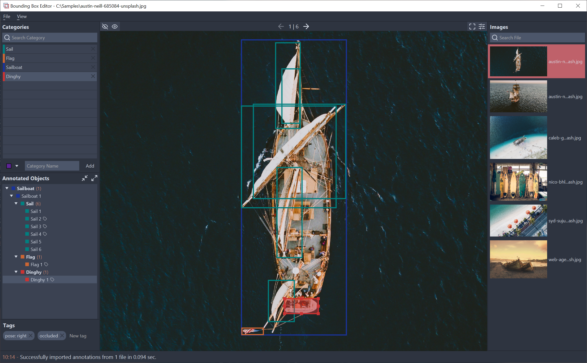

<p>


# Bounding Box Editor
</p>

[](https://dev.azure.com/mfl28/BoundingBoxEditor/_build/latest?definitionId=1&branchName=master)


This is a desktop application written in Java using the JavaFX application platform. It allows you to create image annotations using bounding box object-labels. 
Annotations can be imported and saved from/to xml-files using the [Pascal VOC](http://host.robots.ox.ac.uk/pascal/VOC/) format. The saved annotation data can then further be used, e.g. as ground-truths in the training (and evaluation) of neural networks in order to perform object-detection tasks. 

<p align="center">
  
  </br>
  <em>Demo screenshot of release v1.0.0.</em>
</p>

## Features
* Saving of bounding box annotations in the  [Pascal VOC](http://host.robots.ox.ac.uk/pascal/VOC/) format
* Importing of existing bounding box annotation data in Pascal VOC format, for example from [Google's VOC2012 dataset](http://host.robots.ox.ac.uk/pascal/VOC/voc2012/index.html)
* Nesting of bounding box labels (which is then reflected in the output xml-file)
* Image files side-panel with thumbnails for easy and fast navigation including image-file search
* Tagging of bounding boxes using tags defined in the Pascal VOC format (truncated, difficult, occluded, pose: *, action: *)
* Color-coded object categories
### Planned future features
* Marking of already annotated images in image files side-panel
* Creating general polygonal bounding boxes
* Supporting more input/output formats
* Undo/Redo functionality
* ...

## Latest Release 
Download the latest release of *Bounding Box Editor* for your operating system from the links below. The files are zipped, custom runtime images (created using the [Badass JLink plugin](https://github.com/beryx/badass-jlink-plugin)) that contain binaries to start the application on your system.

| OS            |
| ------------- |
| [Linux](https://github.com/mfl28/BoundingBoxEditor/releases/latest/download/boundingboxeditor-linux.zip)        |
| [MacOs](https://github.com/mfl28/BoundingBoxEditor/releases/latest/download/boundingboxeditor-mac.zip)          |
| [Windows](https://github.com/mfl28/BoundingBoxEditor/releases/latest/download/boundingboxeditor-win.zip)        | 

## How to use the application
Please refer to the [User Manual](https://github.com/mfl28/BoundingBoxEditor/wiki#user-manual) in the [Wiki](https://github.com/mfl28/BoundingBoxEditor/wiki) for a detailed guide to the usage of the application's main functions.

## How to build the application
The project uses [Gradle](https://gradle.org/) as build-system.
You will need to have Gradle version 5+ and a Java JDK version 11+ installed on your system, e.g. from [OpenJDK](https://openjdk.java.net/). 
After cloning the repository into a folder on your machine you may build the application from the root folder by opening a command line and using:
```bash
gradlew build # Add "-x test" to skip the UI-tests.
```
*Note:* The concrete way of invoking `gradlew` depends on your OS and used command line: 
* __Linux & MacOs__: `./gradlew ...`
* __Windows__:
  - Command Prompt: `gradlew ...`
  - Powershell: `.\gradlew ...`

## How to run the application
To run the app using Gradle, use:
```bash
gradlew run
```

## How to run the tests
The project comes equipped with automatic UI-tests which use [TestFX](https://github.com/TestFX/TestFX) and the [JUnit 5](https://junit.org/junit5/) testing frameworks. Due to some used functionality in the implemented tests it is (currently) not possible to run the tests in headless mode.

To run the tests, use :
```bash
gradlew test
```
## Acknowledgements
* [OpenJDK](https://openjdk.java.net/) (open-source implementation of the Java platform)
* [OpenJFX](https://openjfx.io/) (open-source implementation of the JavaFX platform)
* [ControlsFX](https://github.com/controlsfx/controlsfx) (used for progress dialogs)
* [Caffeine](https://github.com/ben-manes/caffeine) (used for caching of images)
* [Apache Commons](https://commons.apache.org/) (used for ListOrderedMap data structure and String/Iterator utilities)
* [TestFX](https://github.com/TestFX/TestFX) (used for the tests)
* [JUnit 5](https://junit.org/junit5/) (used for the tests)
* [Jacoco](https://www.jacoco.org/jacoco/) (used for creating code coverage results)
* [LibSass Gradle Plugin](https://github.com/fgiannesini/LibSassGradlePlugin) (used to compile .scss style-files into [JavaFX supported] .css files)
* [Badass JLink Plugin](https://github.com/beryx/badass-jlink-plugin) (used to create modular runtime images of the application)
* [Gradle Modules Plugin](https://github.com/java9-modularity/gradle-modules-plugin) (used to run the tests on the classpath)
* [Feather Icons](https://feathericons.com/)
* [Nord Color-Palette](https://github.com/arcticicestudio/nord)
* [Unsplash](https://unsplash.com/) (used as source for test- & demo-images)

## License
This project is licensed under GPL v3. See [LICENSE](LICENSE).


