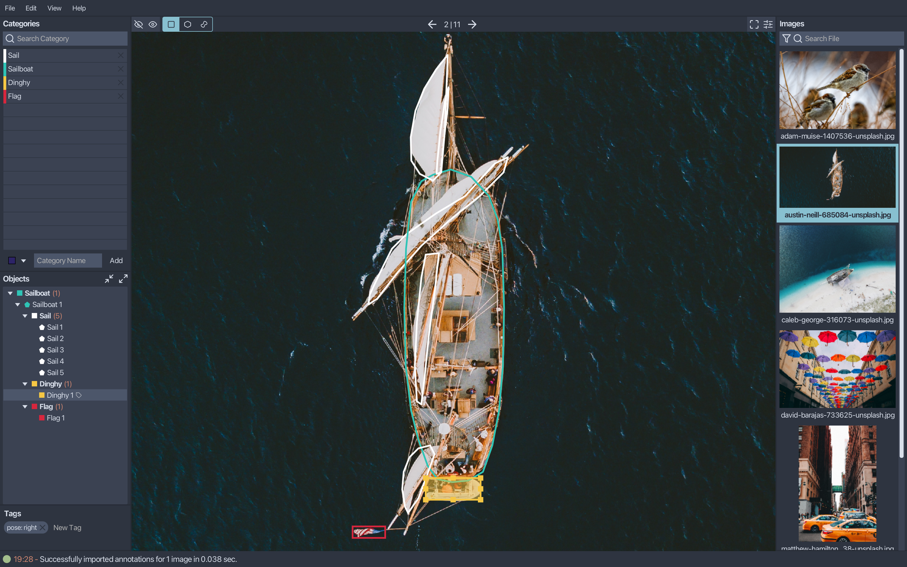

<p align="center">
  
  <br/>
  
</p>

<p align="center">
  <a href="https://github.com/mfl28/BoundingBoxEditor/actions">
    
  </a>
  <a href="https://codecov.io/gh/mfl28/BoundingBoxEditor">
    
  </a>
  <a href="https://sonarcloud.io/dashboard?id=mfl28_BoundingBoxEditor">
    
  </a>
  <a href="https://github.com/mfl28/BoundingBoxEditor/actions/workflows/codeql.yml">
    
  </a>
  
  <a href="https://github.com/mfl28/BoundingBoxEditor/releases/latest">
    
  </a>
  <a href="LICENSE">
    
  </a>
</p>

Bounding Box Editor is a desktop application for annotating objects in images with rectangular and polygonal bounding boxes and pixel masks, e.g. to create training data for object detection and instance segmentation. It is written in Java with JavaFX and runs on Windows, macOS and Linux.
Annotations can be imported and exported in the [Pascal VOC](http://host.robots.ox.ac.uk/pascal/VOC/), [YOLO](https://docs.ultralytics.com/datasets/), [COCO](https://cocodataset.org/#format-data), JSON and CSV formats, and as PNG masks.

<p align="center">
  
  <br>
  <em>Demo screenshot of release v3.0.0.</em>
</p>

## Main Features
* **Drawing and editing:** rectangles and polygons (by clicking vertices or drawing freehand). Move and resize boxes, add, move and remove polygon vertices, and simplify polygons. Copy and paste bounding boxes (also to other images), and move the selected one with the arrow keys.
* **[Pixel masks](https://github.com/mfl28/BoundingBoxEditor/wiki/Bounding-Boxes#shape-specific-functions---pixel-masks)** for instance segmentation: paint and erase objects with a brush of adjustable size.
* **Undo and redo** for all changes to the bounding boxes, with a separate history per image.
* **Nesting and tags:** nest bounding boxes (e.g. a wheel inside a car), and tag them with the Pascal VOC tags (truncated, difficult, occluded, pose, action).
* **Categories:** color-coded and searchable object categories, created as you go. Select one of the first nine with the number keys, and optionally show each bounding box's category name next to it.
* **Import and export:**
  * Pascal VOC (XML) and JSON: rectangles and polygons, including nesting;
  * YOLO (TXT): rectangles, and polygons in YOLO's segmentation format;
  * CSV: rectangles;
  * COCO (JSON): rectangles, polygons and masks;
  * PNG masks (in the layout of Pascal VOC's segmentation data): masks and polygons.

  Invalid files or entries are listed in an error report, and everything else is imported.
* **Image navigation:** a side panel with thumbnails, search by file name, and a filter by annotation status (annotated or not) and by categories. Recently opened image folders are listed in the `File` menu.
* **Predictions:** connect a [TorchServe](https://pytorch.org/serve/) or [LitServe](https://github.com/Lightning-AI/LitServe) server and use its predicted bounding boxes as annotation hints (see [Predictions](https://github.com/mfl28/BoundingBoxEditor/wiki/Predictions) in the wiki for the setup, including an example LitServe server). The settings are remembered between runs.
* **[Keyboard shortcuts](https://github.com/mfl28/BoundingBoxEditor/wiki/Keyboard-Shortcuts)** for navigation, drawing modes, visibility and more.

## Latest Release
[](https://github.com/mfl28/BoundingBoxEditor/releases/latest)


Download the installer or the portable image (no installation required) of the latest release for your operating system. Both include the Java runtime, so no separate Java installation is needed. They are created with [jpackage](https://openjdk.org/jeps/392), the [Badass JLink Gradle plugin](https://github.com/beryx/badass-jlink-plugin) and [GitHub Actions](.github/workflows/workflow.yml).

| OS            | Installer                                                                                                                                                                                                                       | Portable | Stats                                                                                                                                                      |
| ------------- |---------------------------------------------------------------------------------------------------------------------------------------------------------------------------------------------------------------------------------| -------- |------------------------------------------------------------------------------------------------------------------------------------------------------------|
| Linux (x86-64) | [deb](https://github.com/mfl28/BoundingBoxEditor/releases/latest/download/boundingboxeditor_3.1.0_amd64.deb), [rpm](https://github.com/mfl28/BoundingBoxEditor/releases/latest/download/boundingboxeditor-3.1.0-1.x86_64.rpm) | [image](https://github.com/mfl28/BoundingBoxEditor/releases/latest/download/boundingboxeditor-portable-linux.zip)|  |
| Linux (ARM64) | [deb](https://github.com/mfl28/BoundingBoxEditor/releases/latest/download/boundingboxeditor_3.1.0_arm64.deb), [rpm](https://github.com/mfl28/BoundingBoxEditor/releases/latest/download/boundingboxeditor-3.1.0-1.aarch64.rpm) | [image](https://github.com/mfl28/BoundingBoxEditor/releases/latest/download/boundingboxeditor-portable-linux-arm64.zip) |  |
| macOS (Apple Silicon) | [dmg](https://github.com/mfl28/BoundingBoxEditor/releases/latest/download/boundingboxeditor-3.1.0.dmg)                                                                                                                          | [image](https://github.com/mfl28/BoundingBoxEditor/releases/latest/download/boundingboxeditor-portable-macos.zip) |          |
| macOS (Intel) | [dmg](https://github.com/mfl28/BoundingBoxEditor/releases/latest/download/boundingboxeditor-3.1.0-intel.dmg) | [image](https://github.com/mfl28/BoundingBoxEditor/releases/latest/download/boundingboxeditor-portable-macos-intel.zip) |  |
| Windows (x64) | [exe](https://github.com/mfl28/BoundingBoxEditor/releases/latest/download/boundingboxeditor-3.1.0.exe)                                                                                                                          | [image](https://github.com/mfl28/BoundingBoxEditor/releases/latest/download/boundingboxeditor-portable-windows.zip) |          |

### Alternative installation methods
#### Windows
[](https://chocolatey.org/packages/boundingboxeditor)
```
choco install boundingboxeditor
```
#### macOS (Apple Silicon)
```
brew install --cask mfl28/tap/boundingboxeditor
```
The app is not notarized by Apple, so the cask removes the quarantine attribute to allow opening it.

## How to use the application
The [User Manual](https://github.com/mfl28/BoundingBoxEditor/wiki#user-manual) in the wiki describes all functions of the application in detail (with screenshots and GIFs), and the [Keyboard Shortcuts](https://github.com/mfl28/BoundingBoxEditor/wiki/Keyboard-Shortcuts) page lists all shortcuts.

## Using annotations for object detection
After having created annotations for your images, you can use the saved bounding boxes as ground-truths in the training and evaluation of neural networks in order to perform object-detection tasks. How this can be done for any kind of labeled objects using Python and the [Pytorch](https://pytorch.org/) deep learning library is shown exemplarily in the [Humpback Whale Fluke Detection - Jupyter notebook](https://nbviewer.jupyter.org/github/mfl28/MachineLearning/blob/master/notebooks/Humpback_Whale_Fluke_Detection.ipynb) which you can find in my [Machine Learning repo](https://github.com/mfl28/MachineLearning).

## How to build the application
You need a Java JDK version 25 or newer, e.g. [Eclipse Temurin](https://adoptium.net/). The project is built with [Gradle](https://gradle.org/); the Gradle wrapper (`gradlew`) in the repository downloads the right Gradle version, so no separate installation is needed.

After cloning the repository, build the application from its root folder with:
```bash
gradlew build -x test # Without "-x test", the tests are run as well (see below).
```
*Note:* The concrete way of invoking `gradlew` depends on your OS and used command line:
* __Linux & macOS__: `./gradlew ...`
* __Windows__:
  - Command Prompt: `gradlew ...`
  - PowerShell: `.\gradlew ...`

To create an installer for your operating system (in `build/jpackage`), use:
```bash
gradlew jpackage
```

## How to run the application
To run the app using Gradle, use:
```bash
gradlew run
```

## How to run the tests
The project has unit tests and UI tests, which use [JUnit 5](https://junit.org/junit5/) and [TestFX](https://github.com/TestFX/TestFX). The UI tests start the application and control it with the mouse and keyboard, so they need a display (they can't run headless). Don't use the mouse or keyboard while they run.

To run all tests, use:
```bash
gradlew test
```
To run only some tests, e.g. the ones of the model package (which don't need a display), use:
```bash
gradlew test --tests '*.model.*'
```

## How to build the latest Linux image and installers using Docker
First build the Docker image from the cloned repo's root directory using:
```bash
docker image build -t bbeditor .
```
Then create a writable container layer over the image (without starting a container):
```bash
docker container create --name bbeditor bbeditor
```
Finally, copy the directory containing the build artifacts to the host:
```bash
docker container cp bbeditor:/artifacts .
```
> **Alternative**:
> With Docker's BuildKit engine (the default since Docker 23), you can do the whole build with one command:
>```bash
> docker image build --target artifacts --output type=local,dest=. .
>```

## Acknowledgements
* [OpenJDK](https://openjdk.org/) (open-source implementation of the Java platform)
* [OpenJFX](https://openjfx.io/) (open-source implementation of the JavaFX platform)
* [ControlsFX](https://github.com/controlsfx/controlsfx) (used for progress dialogs, popovers and the image filter)
* [Caffeine](https://github.com/ben-manes/caffeine) (used for caching of images)
* [Gson](https://github.com/google/gson) (used for JSON serialization & deserialization)
* [Jackson](https://github.com/FasterXML/jackson-dataformats-text) (used for reading and writing CSV files)
* [Eclipse Jersey](https://eclipse-ee4j.github.io/jersey/) (used as the REST client for inference servers)
* [JTS Topology Suite](https://github.com/locationtech/jts) (used for simplifying polygons)
* [metadata-extractor](https://github.com/drewnoakes/metadata-extractor) (used for reading the EXIF orientation of images)
* [Apache Commons](https://commons.apache.org/) (used for ListOrderedMap data structure and String/Iterator utilities)
* [TestFX](https://github.com/TestFX/TestFX) (used for the tests)
* [JUnit 5](https://junit.org/junit5/) (used for the tests)
* [Mockito](https://site.mockito.org/) (used for the tests)
* [Jacoco](https://www.jacoco.org/jacoco/) (used for creating code coverage results)
* [sass-gradle-plugin](https://github.com/EtienneMiret/sass-gradle-plugin) (used to compile .scss style-files into [JavaFX supported] .css files)
* [Badass JLink Plugin](https://github.com/beryx/badass-jlink-plugin) (used to create modular runtime images of the application)
* [Gradle Modules Plugin](https://github.com/java9-modularity/gradle-modules-plugin) (used to run the tests on the classpath)
* [Feather Icons](https://feathericons.com/)
* [Nord Color-Palette](https://github.com/arcticicestudio/nord)
* [Unsplash](https://unsplash.com/) (used as source for test- & demo-images)

## License
This project is licensed under GPL v3. See [LICENSE](LICENSE).
